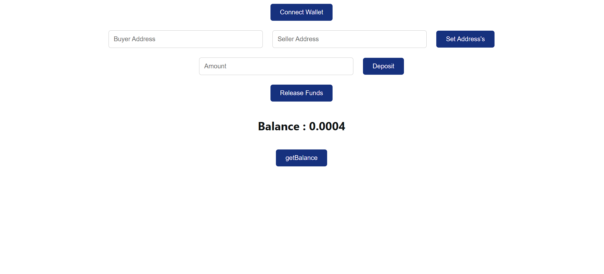
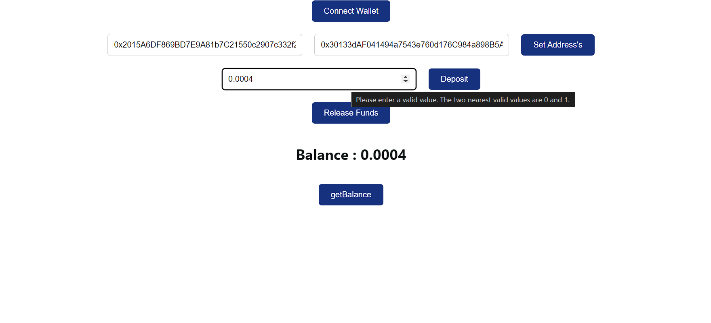

# Escrow Project

A smart contract for a decentralized escrow system and integrate it with a frontend using React.js
Used Web3 library like Ethers.js  for connecting the frontend to the smart contract.

# To Run 
install all npm dependencies in both the main and front_end folder 
Then goto front_end and 'npm start'

